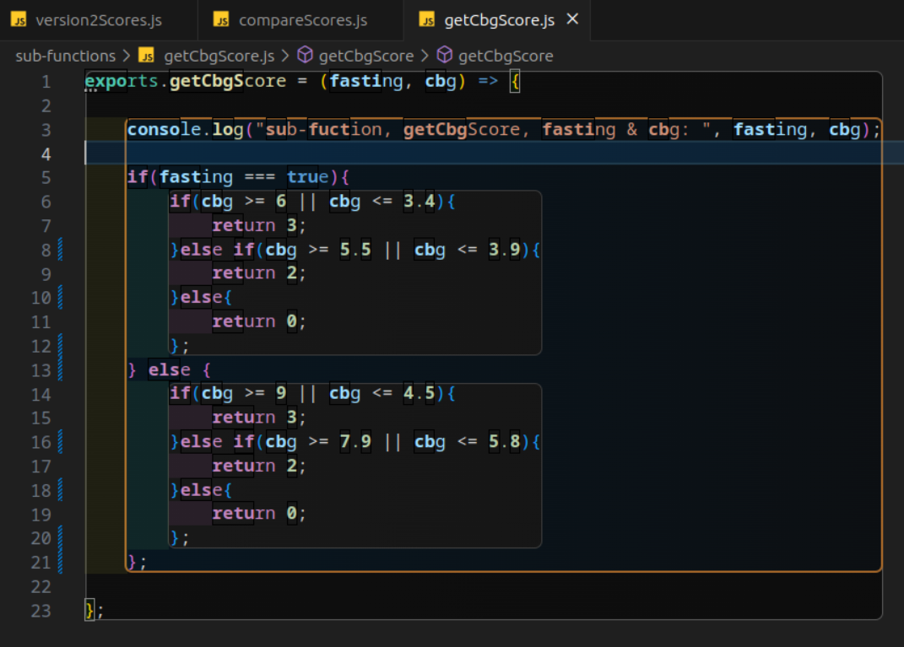
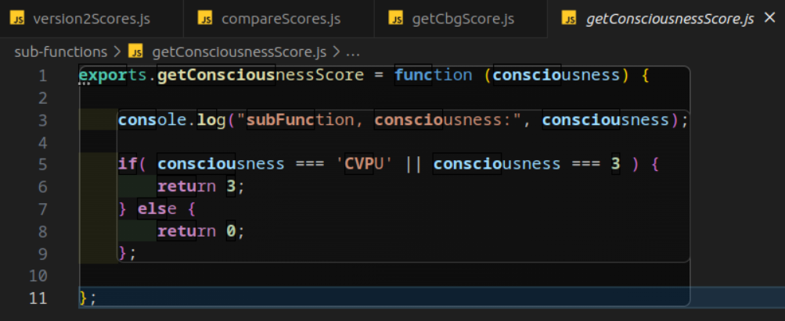

# Medi-Score-Calculation
This is an function which calculates a patient's medi score. 
The score is based on biological observation readings for different categories. 
Those readings translate into scores, which can be added up to their overall score.

## **What's in this repo?**

>
- #### In my **root** folder, there are 2 versions of the assignment function:
>> - **'getPatientScore.js'** which is my first & most instinctive version
>> - **'version2Scores.js'** which I added to show flexibility and versitility
>
Whilst this second version of the function has similar computational efficiency to the first version, it could turn out to be more efficient for maintainance purposes, particularly if there were many more observation/scoring categories added to the function in the future. I prefer the original for simplicity and readability by other developers.
>
- #### In my **__tests__** folder are 3 test files:
>> - A test file for the original function
>> - A test file for the second version
>> - A test file for all the sub functions called in both versions, named **'sub-functions.test.js'**
>
- #### In my **data** folder is a file containing test data:
>> - **'patient-objects.js'** contains 9 patient objects stored in variables which are required into my test files.
>
- #### In my **sub-funtions** folder are 7 sub-functions:
>> - **'getOxygenScore.js'**
>> - **'getConsciousnessScore.js'**
>> - **'getRespirationScore.js'**
>> - **'getSpO2Score.js'**
>> - **'getTemperatureScore.js'**
>> - **'getCBGScore.js'**
>> - **'compareScores.js'**
>
Each of these translate their corresponding data into a score for that category, and are all tested in the **'sub-functions.test.js'** file. **'compareScores.js'** is the function which compares the new score to the latest score and returns an alert message if required.

### Notes

#### Testing

- I have used the Jest testing framework to test my function and sub-functions.
- Although testing was not part of the requirements, I find that they help me to work methodically and to keep track of my progress.
- My testing is based on *'the happy path'* aka, I have assued that object passed in will not contain any unexpected data types or values.
>

#### Assumptions

##### The argument
- The function will be passed a patient object as an argument which looks like this:

`exports.patientA = { 
                    air_or_oxygen: 0, 
                    consciousness: 0,
                    respiration_range: 15,
                    spo2: 95,
                    temperature: 37.1,
                    fasted: false,
                    CBG: 6,
                    latest_score: 1              
                };`

- I have added a *'fasted'* property whose value will be used to work out the CBG score - (More detail below).
- I have added a *'latest_score'* property whose value would be entered by the user along wiht the other observations, and would be used to compare the new score to. This will determine if an alert message is required.
>

##### String functionality
- I have made it so that the sub-functions which translate the first two properties into scores will do so correctly wether they are passed a string or a number.
>

##### spo2
- I have interpreted that the observations for **sp02 will never be below 93 if the patient is on oxygen** and all readings below that will be from patients who are on air:
>

>> - ≤83	
>> - 84–85	
>> - 86–87	
>> - 88–92 (or ≥93 on air)	
>> - 93–94 on oxygen	
>> - 95–96 on oxygen	
>> - ≥97 on oxygen
>

##### Temperature
- Because all of the examples show the patient's temperature already rounded to one decimal place, I have interpreted that the function will not have to do this, and that the data going in will already be rounded:

*'Temperature	Float - This should be rounded to a single decimal place.'*
>

##### Frequency of scoring by the client
- For the extended assignment of creating an alert which is activated when a patient's score has increased by 2 or more points, I have assumed, for the purposes of this exercise, that the patient's observations are taken once in 24 hours - (More detail below).
>

##### The data-type returned by the function
- Whilst the spec clearly states that the function should return a number value, I have interpreted that this applies to only the core logic, and not the extension tasks. I have made it so that when an alert is required, the function returns an object with a score property which has a number value and a message property which has a string value. This is because when a number and string are both returned, the number becomes concatenated into the string, meaning it is no longer a number value. I felt that a number value inside an object would be more useful for any further extended functionality than a string with a number concatenated into it.
>

## CBG Logic

I have added 2 properties to my test data for the CBG tests: fasting - which has a boolean value of true or false, and CBG - which has a number value. The number value translates to a different score depending on wether the patient is fasting or not. eg:

`exports.patient9 = { 
    air_or_oxygen: 2, 
    consciousness: 3,
    respiration_range: 23,
    spo2: 88,
    temperature: 38.5,
    fasted: false,
    CBG: 9.0
};`
>

## Alert Logic

An alert to show when a patient's score has gone up more than 2 points in the last 24 hours would require one of the following:
>

>> ### 1. Assuming the patient scores are collected at various points throughout the day:

- A database to store the patient's scores, which would added to every time the function is run.
- All the scores from the last 24 hours could be checked against the new score to see if it has gone up by more than 2 points.
- If the answer is yes, the function would return the score with an alert message.
>

>> ### 2. Assuming the patient's score is only collected once a day:

- A latest_score property should be added to the patient object so that along with all the other obvs, the latest score is also passed in.
- This way we could access the latest score through the patient object passed in and compare it directly with the new score.
- This way we only compare the new score to one other score, rather than a long list of scores, which would require a database.

>>> #### My Approach

Given that the conversations I have had with Luke suggest that the company do not want me to go down the root of creating a database, using SQL and MVC, I have gone with the second option. Here is an example of the patient object with the latest_score property added:

`exports.patient2 = { 
                    air_or_oxygen: 'oxygen', 
                    consciousness: 'alert',
                    respiration_range: 17,
                    spo2: 95,
                    temperature: 37.1,
                    fasted: true,
                    CBG: 4,
                    latest_score: 3
                };
                                // score --> 4

exports.patient3 = { 
                    air_or_oxygen: 'oxygen', 
                    consciousness: 'CVPU',
                    respiration_range: 23,
                    spo2: 88,
                    temperature: 38.5,
                    fasted: true,
                    CBG: 4,
                    latest_score: 6
                };
                                // score --> 8
                                //*ALERT`

I have added fake data for the latest_score property to my test data, and test to check that the function returns the correct score and alert message if required when the latest_score is passed in.

The spec says that the function must return a number, so I have made it so that when an alert is required, the function returns an object with a score property which has a number value and a message property which has a string value.

### My Process

>> Created files for the main function and all the sub-functions, and required them into the main function file.
>> Created a test file for the main function and all the sub-functions, and required them into the main test file.
>> Created a file for the test data and required it into the main test file.
>> Initially, I only had the shells of each function and wrote pseudo-code inside each one to break down the steps I would need to take to complete the function. this helped me to use tdd whilst also having something to reference as a roadmap.
>> TDD; make sure new tests are failing before continuing to write code.
>> After my first main function and all the sub-functions were passing all my tests, I started to research different and potentially more efficient ways of writing the function.
>> I then created a second version test file which was similar with slight modifications.
>> The I wrote my second version of the main function which used all the same sub-functions.

Below is a screenshot of the first version of my function with the steps broken down and comments explaining what each step is doing. I also used console logs to make sure the main function was receiving the correct values from the each sub-function:

I used console logs in each of my sub-functions to make sure they were all receiving the correct values:

Thank you for your time in reviewing my work. Please let me know if you would like me to explain anything further.