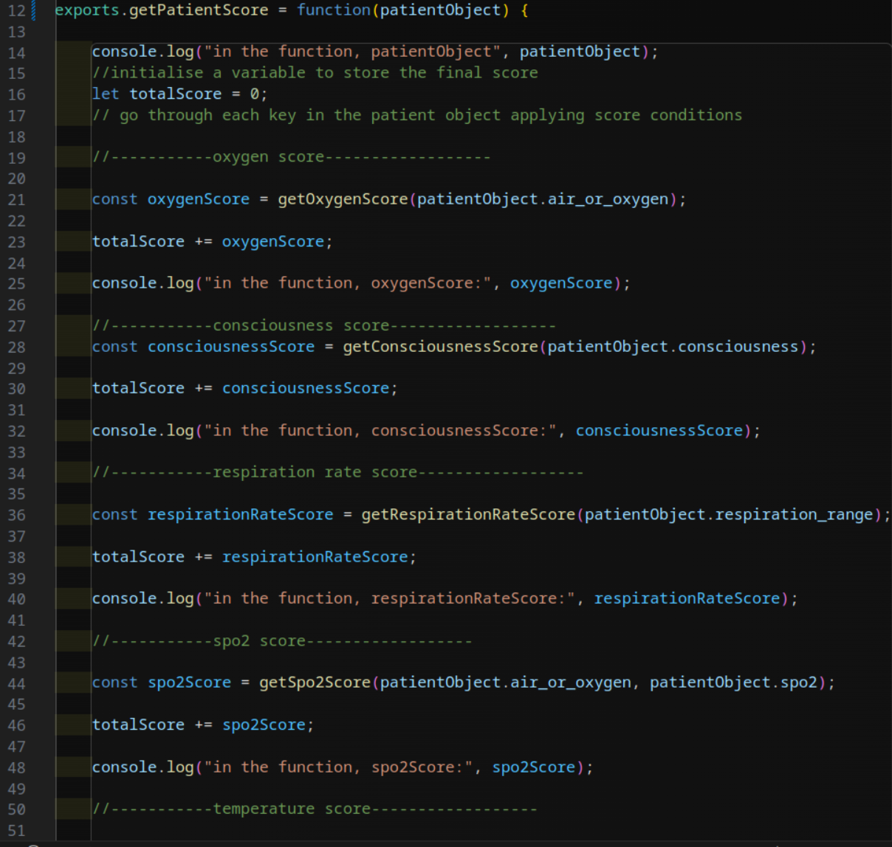
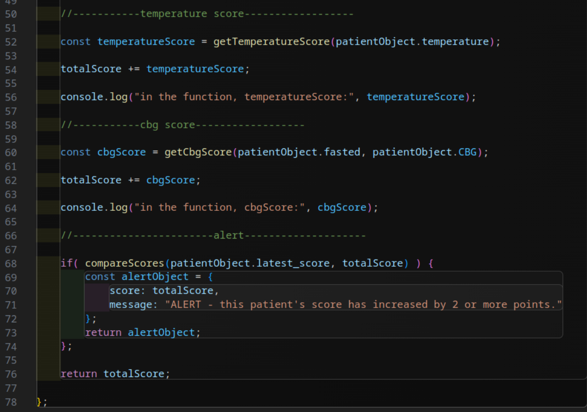

# Medi-Score-Calculation
This is an function which calculates a patient's medi score. 
The score is based on biological observation readings for different categories. 
Those readings translate into scores, which can be added up to their overall score.

# My Approach

From the specifications, I have interpreted that the function I have built will take a patient object as an argument.

The patient object I imagine looks like this:

const patient1 = { 
                    air_or_oxygen: 'air', 
                    consciousness: 'alert',
                    respiration_range: 15,
                    spo2: 95,
                    temperature: 37.1
                };

But given that the first two properties, air_or_oxygen and consciousness, also seem to be recorded as numbers in the spec, I have included alternative patient objects which reflect that:

const patientA = { 
                    air_or_oxygen: 0, 
                    consciousness: 0,
                    respiration_range: 15,
                    spo2: 95,
                    temperature: 37.1
                };

I have made it so that the sub-functions which translate the first two properties into scores will do so correctly wether they are passed a string or a number.

I have interpreted that the observations for sp02 will never be below 93 if the patient is on oxygen and all readings below that will be from patients who are on air:

SpO2 (%)	

- ≤83	
- 84–85	
- 86–87	
- 88–92 (or ≥93 on air)	
- 93–94 on oxygen	
- 95–96 on oxygen	
- ≥97 on oxygen

Because all of the examples show the patient's temperature already rounded to one decimal place, I have interpreted that the function will not have tod do this, and that the data going in will already be rounded:

Temperature	Float - This should be rounded to a single decimal place.

# CBG

I have added 2 properties to my test data for the CBG tests: fasting - which has a boolean value of true or false, and cbg - which has a number value. The number value translates to a different score depending on wether the patient is fasting or not. eg:

exports.patient9 = { 
    air_or_oxygen: 2, 
    consciousness: 3,
    respiration_range: 23,
    spo2: 88,
    temperature: 38.5,
    fasted: false,
    CBG: 9.0
};

## Alert Logic

An alert to show when a patient's score has gone up more than 2 points in the last 24 hours would require one of the following:

# 1. Assuming the patient scores are collected at various points throughout the day:

- A database to store the patient's scores, which would added to every time the function is run.
- All the scores from the last 24 hours could be checked against the new score to see if it has gone up by more than 2 points.
- If the answer is yes, the function would return the score with an alert message.

# 2. Assuming the patient's score is only collected once a day:

- A latest_score property should be added to the patient object so that along with all the other obvs, the latest score is also passed in.
- This way we could access the latest score through the patient object passed in and compare it directly with the new score.
- This way we only compare the new score to one other score, rather than a long list of scores, which would require a database.

--> My Approach

Given that the conversations I have had with Luke suggest that the company do not want me to go down the root of creating a database, using SQL and MVC, I have gone with the second option.Here is an example of the patient object with the latest_score property added:

exports.patient2 = { 
                    air_or_oxygen: 'oxygen', 
                    consciousness: 'alert',
                    respiration_range: 17,
                    spo2: 95,
                    temperature: 37.1,
                    fasted: true,
                    CBG: 4,
                    latest_score: 3
                };
                                // score --> 4

exports.patient3 = { 
                    air_or_oxygen: 'oxygen', 
                    consciousness: 'CVPU',
                    respiration_range: 23,
                    spo2: 88,
                    temperature: 38.5,
                    fasted: true,
                    CBG: 4,
                    latest_score: 6
                };
                                // score --> 8
                                //*ALERT

I have added fake data for the latest_score property to my test data, and test to check that the function returns the correct score and alert message if required when the latest_score is passed in.

The spec says that the function must return a number, so I have made it so that when an alert is required, the function returns an object with a score property which has a number value and a message property which has a string value.

# My Process
Below is a screenshot of the first version of my function with the steps broken down and comments explaining what each step is doing:

